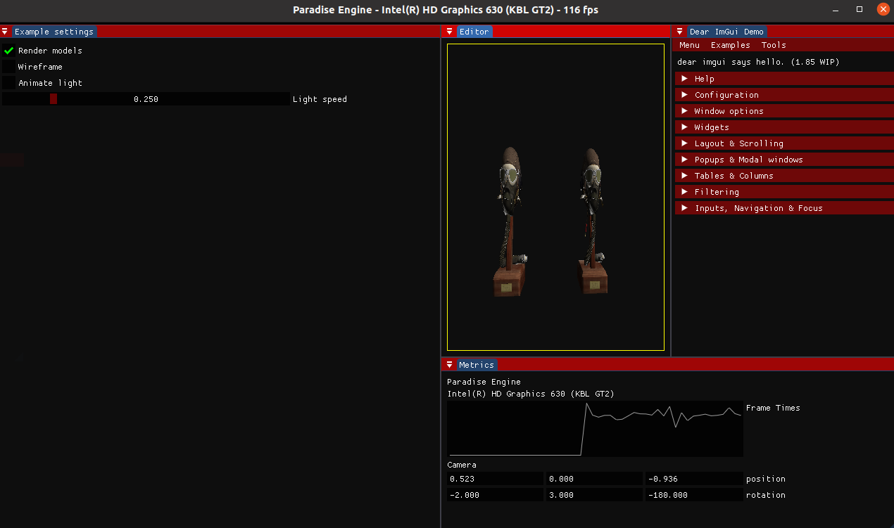

[](https://discord.gg/Xfv3xrxT)

## Paradise Engine

ParadiseEngine is an open source under development game engine based on Vulkan for both Windows and Linux



## CLONING

```bash
git clone --recursive https://github.com/JoseETeixeira/ParadiseEngineVulkan.git
cd ParadiseEngineVulkan
python3 download_assets.py
```

- Install LZ4 for your platform https://github.com/lz4/lz4

## Building - WINDOWS

- Install VulkanSDK
- Install CMAKE
- Install Lua for windows from the root directory
```bash
cmake . 
make
```

- If the process fails, you may need to install Visual Studio 2019

## Building - Linux
```bash
sudo apt install vulkan-tools
sudo apt install libvulkan-dev
sudo apt install vulkan-validationlayers-dev spirv-tools
sudo apt install libglfw3-dev
sudo apt install libglm-dev
sudo apt-get install lua5.1
```

Shader Compiler
on Ubuntu, download Google's [unofficial binaries](https://github.com/google/shaderc/blob/main/downloads.md) and copy glslc to your /usr/local/bin. Note you may need to sudo depending on your permissions. On Fedora use sudo dnf install glslc. To test, run glslc and it should rightfully complain we didn't pass any shaders to compile:

```bash
glslc: error: no input files
```

```bash
cmake . 
make
```


## Tutorials
- https://vulkan-tutorial.com/
- https://www.youtube.com/watch?v=6NWfznwFnMs&t=20s
- https://www.youtube.com/watch?v=JpmK0zu4Mts&t=480s
- https://scons.org/doc/production/PDF/scons-user.pdf
- https://en.wikipedia.org/wiki/Resource_acquisition_is_initialization
- https://www.reddit.com/r/vulkan/comments/fe40bw/vulkan_image_imgui_integration/
- https://github.com/SaschaWillems/Vulkan-glTF-PBR
- https://stackoverflow.com/questions/61263284/having-a-problem-getting-imgui-to-work-with-vulkan
- https://github.com/thepaperpilot/V-ECS
- https://mr-vasifabdullayev.medium.com/multiple-object-rendering-in-vulkan-3d07aa583cec
- http://docplayer.com.br/119226668-Tutorial-geracao-de-binder-para-lua-tutorial.html (TOLUA++ (PORTUGUESE))
- http://vinniefalco.github.io/LuaBridge/Manual.html#s2
- https://github.com/vinniefalco/LuaBridge
- https://github.com/jeremyong/Selene

## COMPILING SHADERS (TEMPORARY, WILL BE AUTO-IMPLEMENTED LATER)

`Windows

Create a compile.bat file with the following contents:

C:/VulkanSDK/x.x.x.x/Bin32/glslc.exe shader.vert -o vert.spv
C:/VulkanSDK/x.x.x.x/Bin32/glslc.exe shader.frag -o frag.spv
pause
Replace the path to glslc.exe with the path to where you installed the Vulkan SDK. Double click the file to run it.

Linux

Create a compile.sh file with the following contents:

/home/user/VulkanSDK/x.x.x.x/x86_64/bin/glslc shader.vert -o vert.spv
/home/user/VulkanSDK/x.x.x.x/x86_64/bin/glslc shader.frag -o frag.spv
Replace the path to glslc with the path to where you installed the Vulkan SDK. Make the script executable with chmod +x compile.sh and run it.`

## TODO:
- Change [staging buffer](https://vulkan-tutorial.com/en/Vertex_buffers/Staging_buffer) to use [VulkanMemoryAllocator] (https://github.com/GPUOpen-LibrariesAndSDKs/VulkanMemoryAllocator)

- Entity Component system https://github.com/skypjack/entt

- Job system https://github.com/hlavacs/ViennaGameJobSystem

## DEBUGGING:

- [RenderDoc](https://renderdoc.org/)